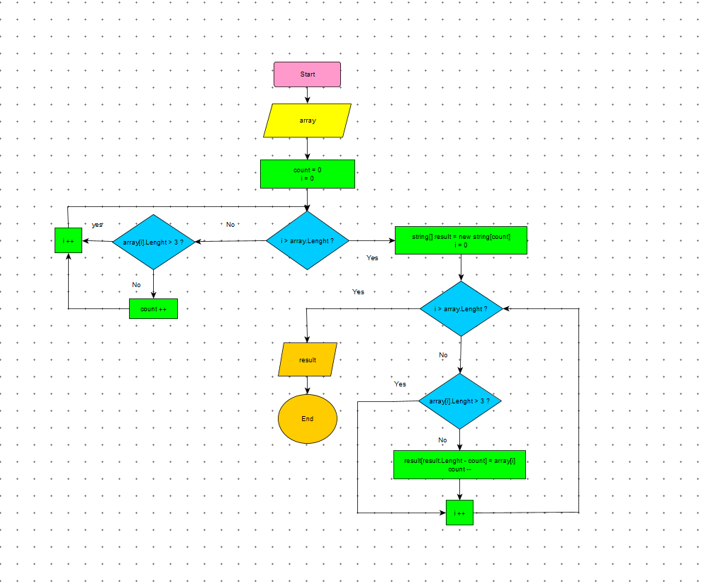

# Итоговая проверочная работа

**Описание задачи**

**Алгоритм программы:**

1. Инициализируем массив с примерами  
2. Инициализируем вспомогательную переменную count = 0,  
в которую запишем количество строк, длина которых 3 символа и меньше.  
3. Вычисляем количество строк, длинна которых меньше либо равна 3 символа.  
4. В цикле проходим по каждой строке массива.  
На каждой итерации сверяем длину строки - если длина меньше или равна трём  
инкрементируем ранее инициализируемую переменную count и инкрементируем счётчик цикла.  
Если длина больше трёх инкрементируем только счётчик цикла.  
5. Инициализируем массив результатов размером count.  
6. Формируем массив с результатами.  
7. Снова в цикле проходим по каждой строке и также сравниваем на каждой итерации длину строки.  
Однако, теперь если длина меньше или равна трём, мы в текущий массив добавляем данную строку,  
декрементируем count и инкрементируем счётчик цикла, иначе только инкрементируем счётчик цикла.  
Декрементировать счётчик количества строк count необходимо для правильного заполнения массива:  
мы из размера массива вычитаем текущее значение данного счётчика.  
8. Выводим массив результатов в консоль.  

**Блок схема по решению**

**Результат работы алгоритма:**

